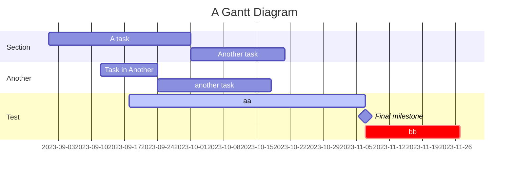

```mermaid
gantt
    title A Gantt Diagram
    dateFormat YYYY-MM-DD
    section Section
        A task          :a1, 2023-09-01, 30d
        Another task    :after a1, 20d
    section Another
        Task in Another :2023-09-12, 12d
        another task    :24d
    section Test
	        aa : active, aa, 2023-09-18, 50d
        Final milestone : milestone, m1, after aa, 0d
        bb : crit , bb , after aa, 20d
```
