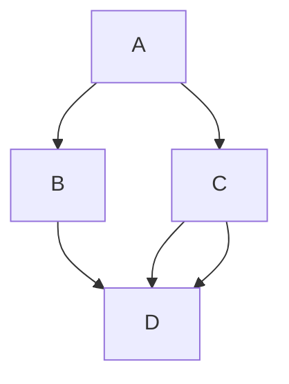
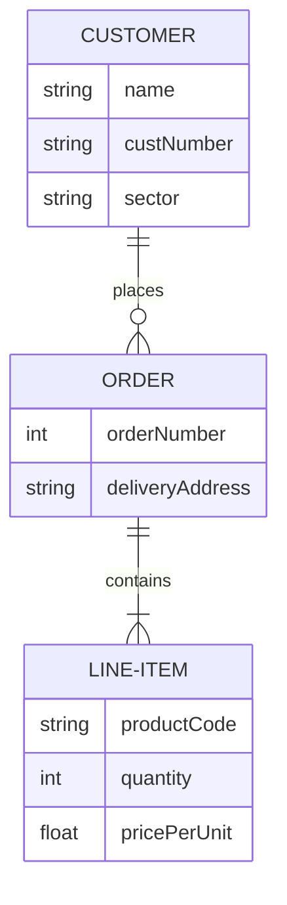
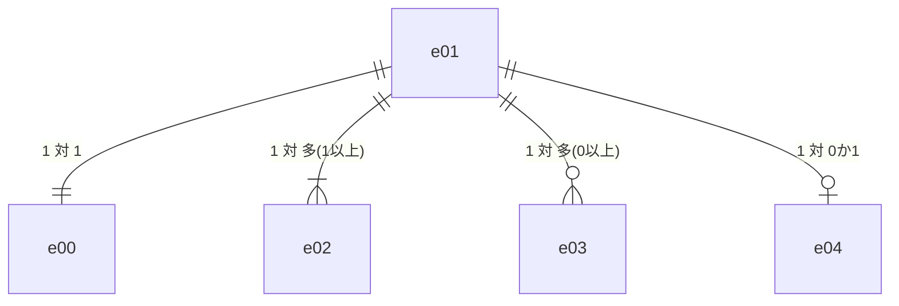
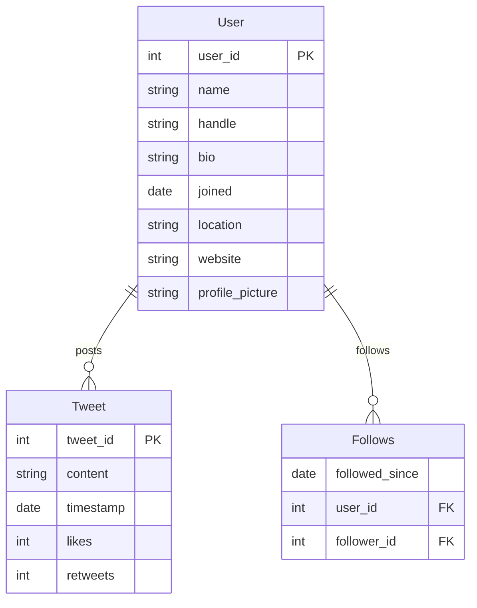

```mermaid
graph TD;
    A-->B;
    A-->C;
    B-->D;
    C-->D;
    C-->D;
    
```

---

```mermaid

erDiagram
    CUSTOMER ||--o{ ORDER : places
    CUSTOMER {
        string name
        string custNumber
        string sector
    }
    ORDER ||--|{ LINE-ITEM : contains
    ORDER {
        int orderNumber
        string deliveryAddress
    }
    LINE-ITEM {
        string productCode
        int quantity
        float pricePerUnit
    }
```

---

```mermaid
erDiagram
  e01 ||--|| e00: "1 対 1"
  e01 ||--|{ e02: "1 対 多(1以上)"
  e01 ||--o{ e03: "1 対 多(0以上)"
  e01 ||--o| e04: "1 対 0か1"

```

---

```mermaid
erDiagram
    User ||--o{ Tweet : posts
    User ||--o{ Follows : follows
    User {
    int user_id PK
        string name
        string handle
        string bio
        date joined
        string location
        string website
        string profile_picture
    }
    Tweet {
    int tweet_id PK
        string content
        date timestamp
        int likes
        int retweets
    }
    Follows {
        date followed_since
                int user_id FK
                int follower_id FK
    }


```
